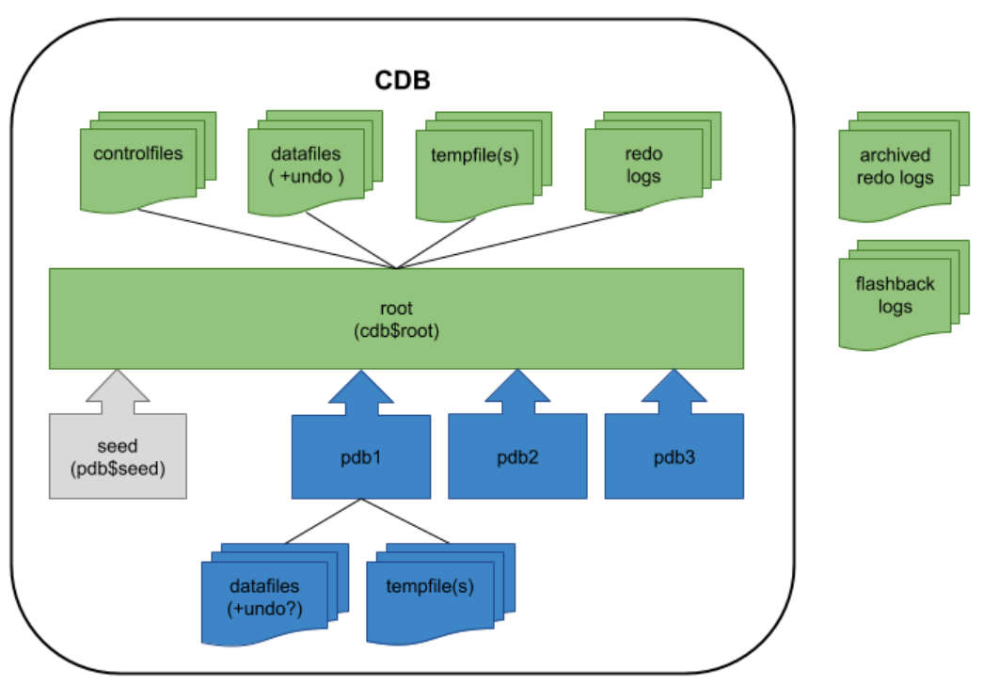

# 개요

- Oracle Architecture

- [Data Warehouse](https://docs.oracle.com/en/database/oracle/oracle-database/21/dwhsg/introduction-data-warehouse-concepts.html#GUID-A53F7799-A01E-42F2-9B75-189D773479C5 )

- 데이터 처리 기술
  - 관계형 DBMS: 자료구조(Table) + 입출력 명령(SQL)
  - 비관계형 DBMS: 자료구조(Table, List, Tree, KV, ..) + 입출력 명령(SQL, ...)
  - 분산 프로그래밍 프레임워크: 하둡(분산 저장 + 분산 처리), ... 

- Data와 Logic 중 누굴 움직일 것인지 항상 고민해야 함

- [Multitenant](https://oracle-base.com/articles/12c/multitenant-connecting-to-cdb-and-pdb-12cr1) 

  - Container Database (CDB)
    - 데이터베이스 작업에 대한 대부분의 것이 포함 되어 있음
      - controlfiles, datafiles, undo, tempfiles, redo logs, data dictionary for those objects that are owned by the root container and those that are visible to all PDBs, etc.
  - Pluggable Database (PDB)
    - 이미 CDB에 작업에 대한 부분이 포함되어 있어 자체 정보만 포함하면 됨
    - 대신 자체 객체를 처리하기 위해 데이터 파일과 임시 파일로 구성
      - 여기에는 PDB에 특정한 개체에 대한 정보만 포함하는 자체 데이터 사전이 포함
  - 루트 컨테이너에 있는 공통 개체와 PDB의 데이터 사전에 있는 PDB 특정 개체 간의 데이터 사전 분할은 다중 테넌트 옵션에 유연성을 제공하기 때문에 매우 중요

